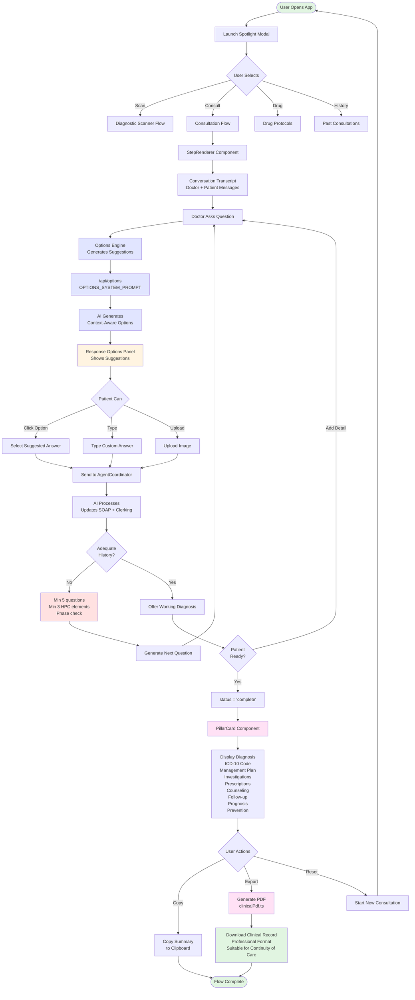
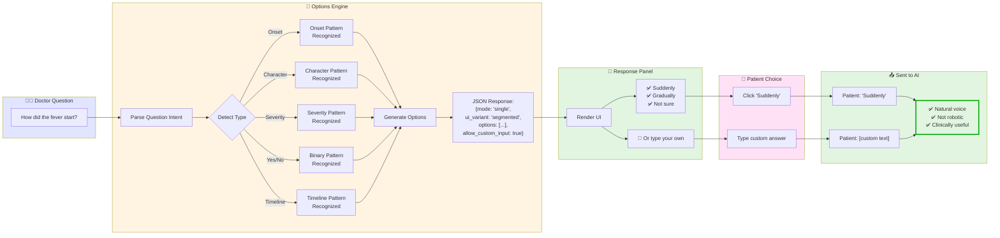
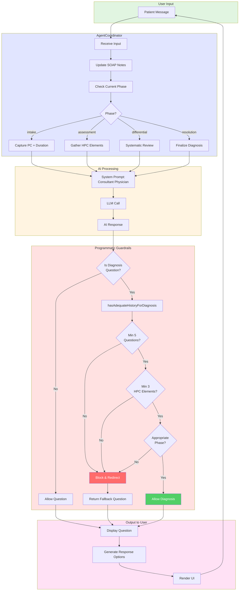
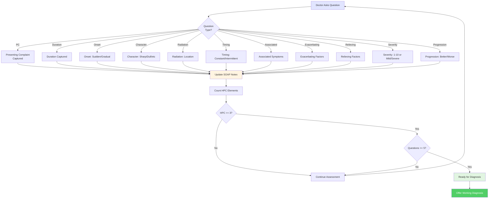

# Complete User Flow Diagrams

**Date:** 2026-03-14  
**Purpose:** Visual documentation of the complete user journey through Dr. Dyrane

---

## Diagram 1: Full User Flow (Landing → Diagnosis → PDF)

---

## Diagram 2: Response Options System (How Suggestions Work)

---

## Diagram 3: Clerking System Architecture

---

## Diagram 4: HPC Element Coverage Flow

---

## Usage Notes

These diagrams illustrate:

1. **Complete User Flow** - The entire journey from app launch to PDF export
2. **Response Options System** - How intelligent suggestions help patients answer naturally
3. **Clerking System Architecture** - The programmatic guardrails that ensure quality
4. **HPC Element Coverage** - How the system tracks clinical history completeness

All diagrams use Mermaid syntax and can be rendered in:
- GitHub markdown
- VS Code with Mermaid extension
- Documentation sites (GitBook, Docusaurus, etc.)
- Mermaid Live Editor (https://mermaid.live)

---

## Related Documentation

- `docs/FULL_USER_FLOW_ANALYSIS.md` - Detailed text analysis
- `docs/IMPROVED_CLERKING_SYSTEM.md` - Technical implementation
- `docs/RESPONSE_OPTIONS_ENHANCEMENT.md` - Options engine details
- `docs/WHY_PREVIOUS_APPROACH_FAILED.md` - Lessons learned

